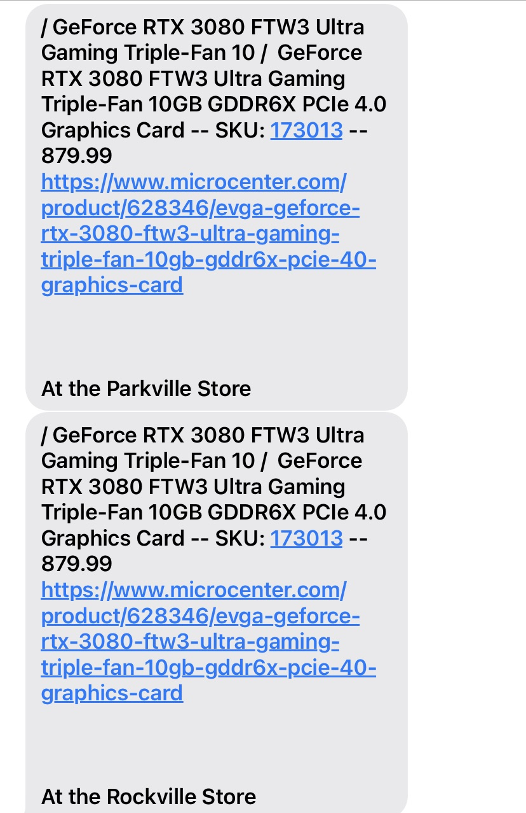

# MicroCenter Stock Checker

Pretty simple script that will scrap Microcenters website and text
 you or email you when you item/s come into stock.




## Setup
1. Clone the Repo
2. Generating App Password in your [gmail settings](https://myaccount.google.com/u/2/security)
    - First turn on 2 step verification to use app passwords
    - Next Under 'Signing in to Google' Select App Passwords
    - Click 'Select App' Drop down and hit other
    - Give it some arbitrary name and the generate
    - Copy that password into the field 'gmail_password'
3. Configure your settings in the top of main.py
    - STORES: The ID of the stores you wish to check.
    - ITEMS: List of URLs for the items you wish to check
    - recipient: Where to send the message
    - gmail_sender: Your Gmail account you wish to email from
    - gmail_password: You need to generate an app password, see previous step


4. ```pip install -r requirements.txt```
5. Run ```python3 main.py```
  - If you want to run this as a back ground process ```nohup python3 main.py &```

It will now text/email you when you item is back in stock


